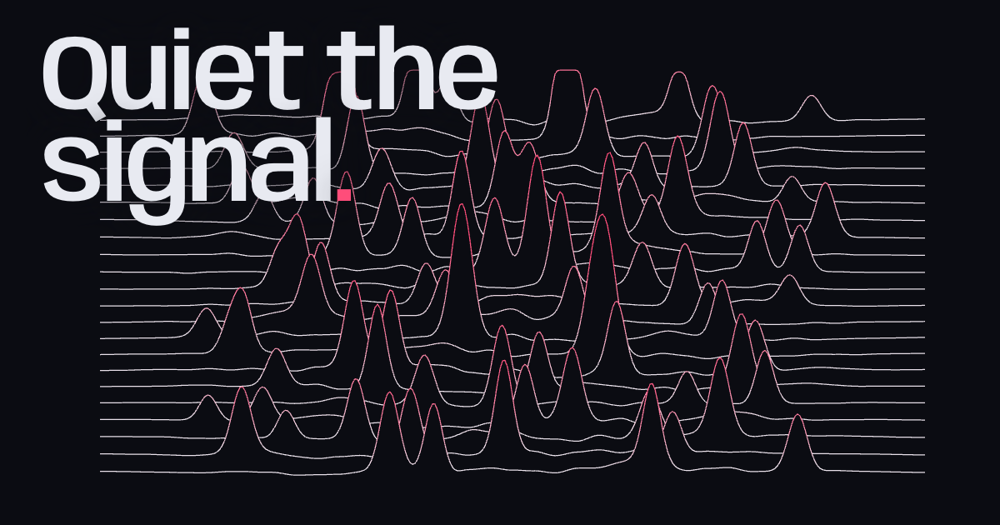

# dopamine

**Quiet the signal.** Live at **[dopamine.lukewhaley.workers.dev](https://dopamine.lukewhaley.workers.dev)**.

 An attention simulator: choose what goes into your morning and watch a live signal field react, then start a focus session.



## What it does

- **The field.** A ridgeline plot of your time window. Each line is a slice of time. Quick hits (short-form video, feeds, notifications) add sharp spikes. Everyday inputs add soft bumps. Breathing room calms everything.
- **The headline reacts.** "Quiet the signal" is set in [Anybody](https://fonts.google.com/specimen/Anybody), a variable font. Calm days set it wide and light. Noisy days crush it narrow and heavy.
- **Focus sessions.** Name a task, pick 15/25/45/90 minutes, press <kbd>F</kbd>. The page clears to a fullscreen timer. It survives reloads, shows the countdown in the tab title, and chimes when time is up.
- **Shareable mixes.** Your selection lives in the URL hash, so you can copy a link to any scenario.
- Light and dark themes, full keyboard support, `prefers-reduced-motion` respected, and nothing leaves your browser.

> This is a metaphor for attention, not a measurement of dopamine or a medical model. Activity weights are fixed and illustrative.

## Develop

```sh
npm install
npm run dev
```

## Deploy

Hosted on Cloudflare Workers static assets (see `wrangler.jsonc`).

```sh
npm run deploy
```

## Stack

React 19, Vite, Canvas 2D, Lucide icons. Type: Anybody, Hanken Grotesk, Martian Mono.

## License

MIT
